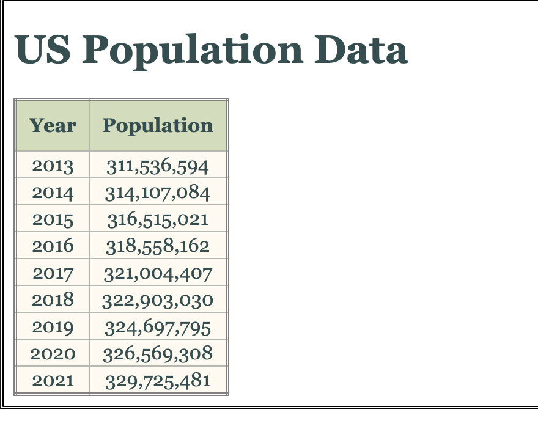
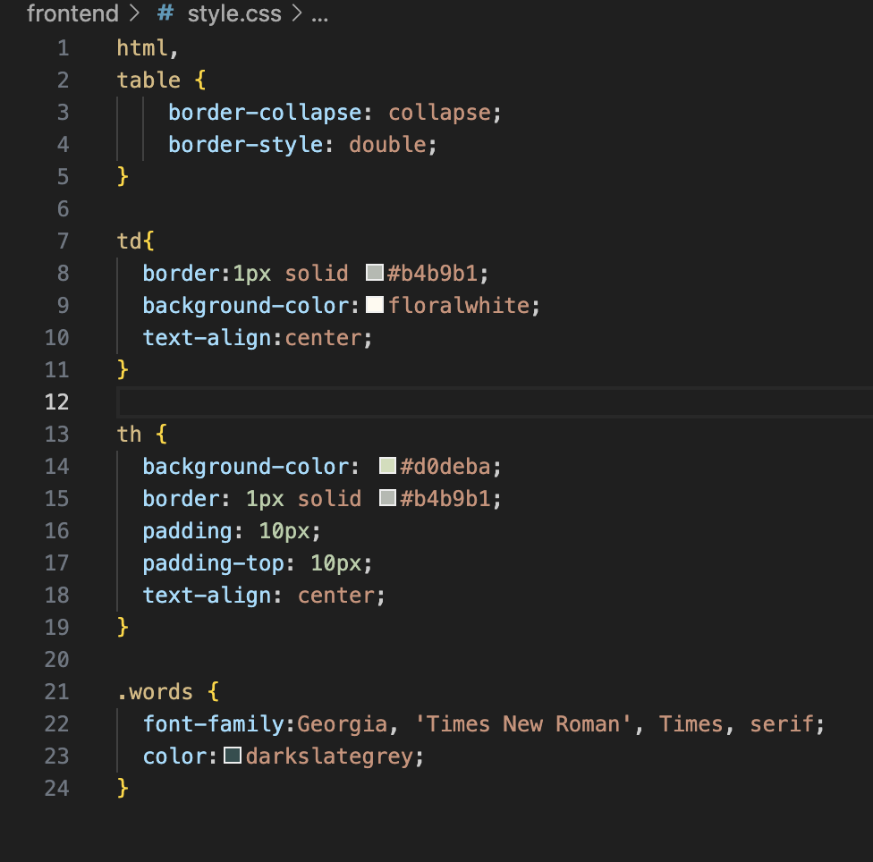
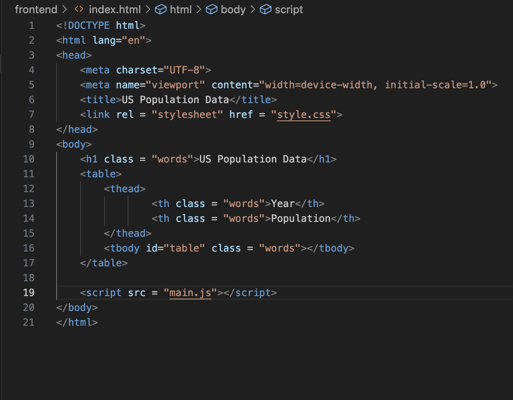
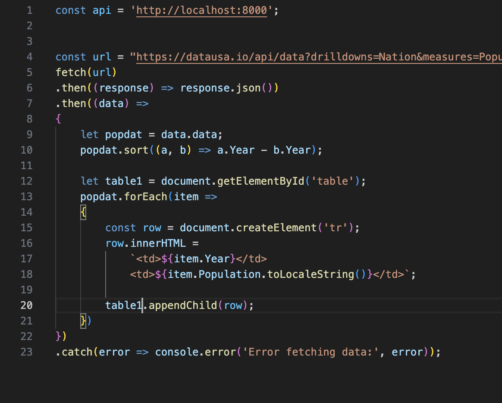

# Assignment2

These files produce an API-hosted website which displays the census population of the United States over the past ten years. The data is displayed in a stylized graph, with design assets supplemented by the attached style.css file.

Below is the style.css file.

The HTML file creates the readable format in which the data can be displayed, drawing upon the other files in the frontend folder.

The main.js file fetches the data from the website and parses it into fitted columns of data. Then, it adds the data to the table using the .CreateElement() function

